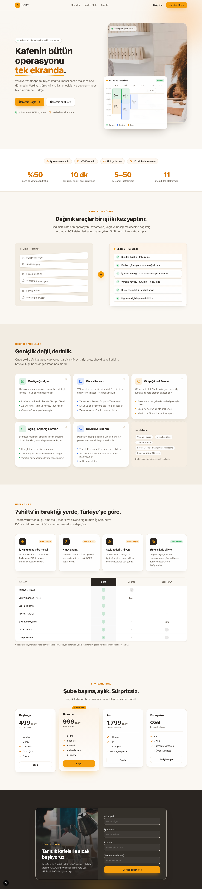
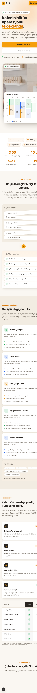

# Shift — Gün 35: Pazarlama Sitesi TEMEL YÖN DEĞİŞİMİ (karanlık "matrix" → aydınlık/sıcak 7shifts hissi)

> [!info] Bugünün hedefi Gün 34'teki site teknik olarak çalışıyordu AMA görsel yön **yanlıştı**: her şey kapkara ink zeminde, mono (kod) font baskın, ekran baştan sona koyu ve soğuk — bir kafe sahibine değil bir yazılımcıya hitap ediyordu. Berke'nin sözü: _"OLMAMIŞ. Bu ne, Matrix sitesi mi?"_ Bu tur **kökten yön değişimi**: içerik/mimari/kütüphaneler KORUNDU; renk/zemin/font/kompozisyon + insan fotoğrafı tamamen değişti. Hedef: **7shifts.com'un aydınlık, ferah, sıcak, İNSANLI hissi.** `web/` ve `src/`'ye yine SIFIR dokunuş.

**Tarih:** 3 Temmuz 2026 · **Stack:** Next.js 16.2.9, React 19, Tailwind 4, framer-motion 12, lucide-react · **Durum:** ✅ Gün 35 tamamlandı — palet TERSİNE çevrildi (beyaz/sıcak taban), mono başlık/gövde/nav'dan söküldü, gerçek kafe-çalışanı fotoğrafı (Unsplash açık-lisans) + zarif fallback, havadar 7shifts kompozisyonu; tsc 0, build 0 (SSG), mobil 375px taşma yok, konsol hatasız. **Bu turda #P7 (headless PNG) ÇÖZÜLDÜ** — ekran görüntüleri repoya gömüldü (§7).

---

## 1. Ne korundu, ne değişti

**Korundu (yeniden yazılmadı):** `marketing/` ayrı proje (port 3001, `web/`+`src/` zero-touch), `lib/content.ts` (spec içeriği), `lib/config.ts` (`APP_URL`), spec fiyatları (499/999/1.799/Özel), 9 bölüm yapısı, framer-motion + lucide + clsx + `next/font`, hero çizelgesinin canlı DOM oluşu + "yerleşme" animasyonu, **Gün 34'ün CSS-keyframe dersi** (above-fold içerik JS animasyon bitişine bağlı görünmez KALMASIN — sabit kaldı).

**Değişti (kökten):** renk paleti (koyu→aydınlık), zemin (ink→paper), font (mono baskın→sıcak humanist sans), kompozisyon (sıkışık→havadar), **insan fotoğrafı eklendi** (sıcaklığın ana kaynağı), çizelge blokları koyu→pastel/açık zemin, koyu/açık oranı **tersine döndü** (eskiden ~%90 koyu → şimdi ~%90 açık, sadece kapanış CTA + footer koyu).

## 2. Renk — TERSİNE ÇEVİR (kavram)

Eski taban _ink_ (`#12182b` lacivert) idi ve her bölüm onun üstüne kuruluyordu. Yeni tabanda **sıcak kağıt beyazı** (`--color-paper #faf7f2`) ana zemin; ink artık **taban değil**, yalnız **metin rengi** + sayfanın en altındaki tek sıcak koyu bant (CTA/footer). Ink'i de soğuk lacivertten **sıcak antrasite** (`#2a2521`) çektik — kahve/ahşap sıcaklığına yaklaşsın.

- **Aydınlık taban:** paper `#faf7f2`, paper-deep `#f2ece2`, surface `#ffffff`, krem aksan `#fdf3e7`.
- **Aksanlar:** amber `#f59e0b` (KALDI) + ikincil sıcak turuncu `#f97316` + yumuşak şeftali `#fdba74`. Amber tek başına taşımıyor; krem/şeftali zeminlerle "kafe sıcaklığı" veriyor. _Cream+terracotta klişesine_ düşmeden sıcak.
- **Çizelge veri renkleri** (barista yeşil / kasiyer mavi / komi amber) KALDI ama artık açık zeminde **pastel**: `color-mix(role 13%, white)` zemin + renkli sol şerit + koyu metin (kapkara blok yok).

> [!question] Mülakat Sorusu **"Sadece `background: white` yapsan olmaz mıydı, neden token'ları tersine çevirdin?"** Cevap: Renk yönü bir _sistem_; tek property değil. Site 9 bölümde ~40 yerde `bg-[var(--color-ink)]`, `text-white`, `border-white/10` gibi **koyu-zemin varsayımına** göre kurulmuştu. Zemini beyaz yapıp metni beyaz bırakmak beyaz-üstü-beyaz verir. Doğru yol: her bölümün koyu/açık _rolünü_ yeniden atamak (hero paper, modüller paper-deep, pricing paper, sadece CTA/footer ink) ve on-dark/on-light sınıflarını ona göre çevirmek. Token değerini değiştirmek ucuz; asıl iş **kompozisyonun ışık mantığını** tersine çevirmekti.

## 3. Font — MONO'YU BIRAK (en büyük "matrix-tell")

Eskiden IBM Plex **Mono** her yerdeydi (nav alt-etiketi, bölüm başlıkları üstü etiket, footnote, badge) → "kod/terminal" hissi. Bu turda mono **yalnız minik veri etiketlerinde** kaldı: çizelge saat rakamları (`08:00`) ve blok saat aralıkları. Başlık/gövde/nav/badge/footnote → temiz sans.

- **Display (başlık):** Space Grotesk (geometrik/teknik) → **Plus Jakarta Sans** (sıcak, humanist, yuvarlak hatlı, davetkâr). `latin-ext` ile Türkçe ş/ğ/ı/İ/ö/ü/ç tam.
- **Gövde:** IBM Plex Sans (korundu — okunur, güçlü Türkçe diakritik).
- Nav'daki `kafe operasyonu` mono alt-etiketi **kaldırıldı**; logoya amber "S" markası eklendi.

## 4. İnsan fotoğrafı — sıcaklığın ana kaynağı (Berke açıkça istedi)

7shifts'in sıcaklığı **gerçek restoran çalışanı fotoğraflarından** gelir. Ekledik:

- **Hero:** gülümseyerek müşteriye hizmet veren bir çalışan (Unsplash `photo-1556742049-0cfed4f6a45d`) — aydınlık, sıcak, insanlı. Üstüne **bindirilmiş canlı vardiya kartı** (7shifts'in app-screenshot-over-photo deseni) + minik "Ayşe giriş yaptı · 08:02" chip'i (ürün canlı görünsün).
- **Kapanış CTA (tek koyu bant):** bir baristanın filtre kahve demleyişi (`photo-1442512595331-e89e73853f31`), üstüne sıcak-koyu degrade + metin overlay — koyu bandı bile insanlaştırdı.

> [!important] Foto kaynağı + kırık-resim güvencesi Kaynak yalnız **açık-lisans** (Unsplash, ücretsiz ticari). Foto ID'leri build-zamanı `curl` ile 200 doğrulandı VE görsel içerikleri tek tek incelendi (kafe/çalışan/sıcak ton). Yine de yeni bir `Photo` bileşeni var: foto yüklenemezse **ASLA kırık-resim ikonu** göstermez → sıcak degrade (krem→amber) + silüet ikonuna zarif düşer. Kullanıcının _tarayıcısı_ Unsplash'e istek atar (build ortamı değil), statik/SSG'de sorun yok.

> [!question] Mülakat Sorusu **"Neden `next/image` değil düz ``?"** Cevap: `next/image` harici host için `next.config` `remotePatterns` ister ve optimizasyon sunucusu/loader devreye girer; bu site **statik/SSG, backend'siz** ve foto tek-tük dekoratif. Düz `` + `loading`/`decoding` + `onError` fallback burada daha az sürtünme, sıfır config, ve fallback kontrolü bizde. Ölçek büyürse (foto galerisi) `next/image`'a geçilir — şimdilik gap değil, bilinçli sadelik.

## 5. Kompozisyon — 7shifts gibi ferah

- **Hero:** sol metin + sağ görsel dengesi havadar (`lg:grid-cols-[1.02fr_1fr]`, `gap-10`, cömert padding). Sağ görsel = foto + bindirilmiş çizelge + canlı chip.
- **Sosyal kanıt şeridi hero'nun HEMEN altında, görünür:** İş Kanunu · KVKK · Türkçe · 10 dk rozetleri + spec istatistikleri (%50 / 10 dk / 5–50 / 11). Sahte müşteri logosu YOK.
- **Bölüm ritmi artık aydınlık:** hero(paper) → social(surface) → problem(paper) → modüller(paper-deep) → neden(paper) → fiyat(paper) → **sadece** kapanış CTA + footer koyu (tek sıcak kapanış bölgesi).
- Problem→Çözüm'ün "sağ" (Shift) kartı eskiden koyu ink idi → artık **sıcak krem/amber** kart. Modüller & Pricing kartları koyu → beyaz.

## 6. Kalite tabanı (korundu)

Amber `focus-visible` halkası, `prefers-reduced-motion` (tüm animasyon kapanır), çizelgeye `role="img"`+`aria-label`, above-fold girişleri SAF CSS keyframe (`.anim-rise/.anim-settle/.anim-float` + `animation-fill-mode: both`) — arka planda yüklenen sekmede bile içerik görünür (Gün 34 dersi sabit). Framer scroll-reveal + mobil menü + hover için korundu.

## 7. #P7 ÇÖZÜLDÜ — headless PNG repoya gömüldü

Gün 34'te önizleme sekmesi başsız olduğu için PNG çıkmamıştı. Bu tur **Chrome `--headless=new --screenshot`** ile çözüldü. Kritik numara: **çok uzun `--window-size` yüksekliği** (ör. 1280×5600) verince framer'ın `whileInView` reveal'leri _tüm bölümler viewport içinde_ sayıldığı için tetiklenir → aşağı-fold bölümler opacity:0'da kalmaz. `--virtual-time-budget=3500` de giriş animasyonlarını ilerletir.

**Berke için canlı onay:** `cd marketing && npm run dev` → `http://localhost:3001`.

## 8. Kendi işini eleştir ("aydınlık ve sıcak mı, yoksa hâlâ koyu/soğuk mu?")

Masaüstü (1280) + mobil (375/390) ekran görüntüleri alınıp incelendi. Değerlendirme: sayfanın geneli **beyaz/sıcak**, hero **aydınlık**; "matrix" hissi gitti. Mono başlık/gövde/nav'da yok. Gerçek gülümseyen çalışan fotoğrafı + krem/amber palet + pastel çizelge sıcaklığı veriyor. Sosyal kanıt şeridi görünür, kompozisyon havadar. **7shifts'e benziyor** (beyaz zemin, staff foto, app-over-photo çizelge, okunur sans, yumuşak aksan). Küçük gözlem: mobilde çizelge kartı fotoğrafın alt yarısını örtüyor (ürün-kanıtı fotoğrafın önünde) — kabul edildi.

## 9. Geçti Kriteri

| # | Senaryo | Sonuç | Doğrulama |
|---|---------|-------|-----------|
| 1 | Sayfa geneli açık/beyaz; hero aydınlık; "matrix" gitti | ✓ | desktop + mobil PNG |
| 2 | Mono başlık/gövde/nav'da YOK; sadece minik veri etiketi | ✓ | layout.tsx + DOM |
| 3 | Hero'da insan fotoğrafı VAR (Unsplash açık-lisans) + fallback | ✓ | Photo.tsx + screenshot |
| 4 | Sıcak palet; amber + şeftali; çizelge pastel açık zemin | ✓ | globals.css + görsel |
| 5 | Sosyal kanıt şeridi hero altında görünür; havadar | ✓ | screenshot |
| 6 | 9 bölüm açık; en çok CTA+footer koyu; fiyat 4 kart "Büyüme" popüler | ✓ | screenshot |
| 7 | Mobil 375px: taşma yok, hamburger, foto+çizelge düzgün iner | ✓ | `scrollWidth==innerWidth==375` |
| 8 | tsc 0, build 0 (SSG); `web/`+`src/` git diff temiz | ✓ | `tsc --noEmit`, `next build`, `git status` |
| 9 | Konsol hatasız | ✓ | preview console (error) = boş |

## 10. Açık gap'ler (etiketlendi, kapatılmadı)

- **#P1** lead-capture backend (form hâlâ `mailto:`), **#P2** KVKK/Gizlilik metni (footer placeholder), **#P3** domain deploy, i18n, blog, **#P6** OG/favicon.
- **Yeni:** profesyonel/telifli özel foto çekimi (şimdilik stok) → gap. Gerçek app screenshot'ları (canlı-DOM çizelge yerine) → gap.
- **#P7** (headless PNG) → ✅ bu tur ÇÖZÜLDÜ.
